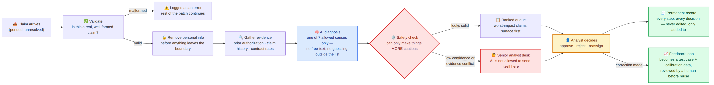
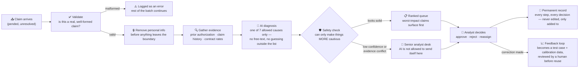
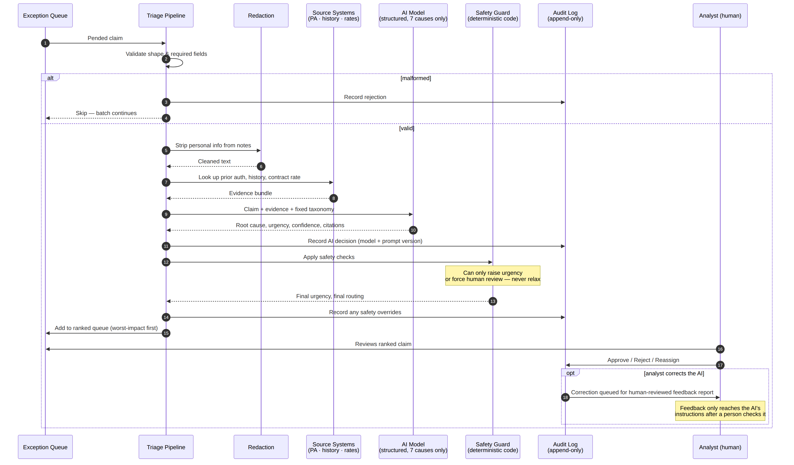
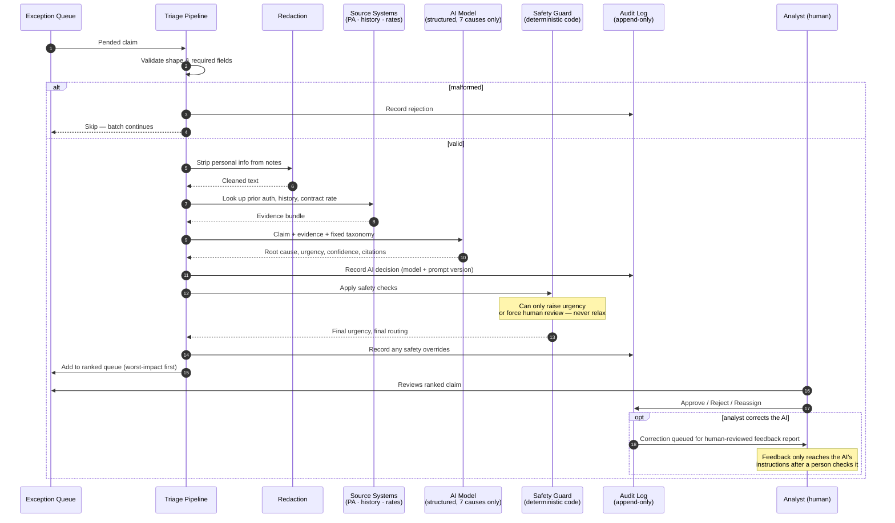

# Architecture — Claims Exception Triage Assistant

Submission component · Shilpi Verma · Cohort 5 · 2026-08

This document is written for a reviewer or sponsor deciding whether this system is well-designed, not for an engineer implementing it — the code-level detail lives in `AI_EVIDENCE.md`, `ENTERPRISE_READINESS.md`, and inline comments. Two diagrams below: **what happens to a claim** (the flow), and **what talks to what, in order** (the sequence). Both describe the system exactly as it runs today — one straight-through pipeline, no retrieval, no agents, no runtime branching the code itself doesn't control.

---

## 1. The flow, in plain terms

A claim enters as a stuck item in an exception queue and leaves as a ranked, evidence-backed recommendation sitting in front of a human. Nothing in between executes an action — every box is either read, reason, or record.

**Read it as five ideas, not eight boxes:**

1. **Nothing bad-shaped gets in.** A claim is checked before anything else touches it. If it's malformed, it's logged and skipped — one bad record never stops the other 74.
2. **Nothing personal leaves the boundary.** Free-text notes are scrubbed before any external model call.
3. **The AI never answers blind.** It's handed evidence from three source systems first, and it can only answer with one of exactly seven pre-defined causes — never free text, never a guess outside the list.
4. **Code has the final word, not the model.** A deterministic safety layer can only make the outcome *more* cautious — raise urgency, force a second look — never less. It is structurally forbidden from deciding a case is safe to skip.
5. **A human closes every loop.** Every recommendation lands in front of an analyst who approves, rejects, or reassigns it. The system never acts on its own, and a correction only changes future behavior after a person reviews it.

Mermaid source (renders natively on GitHub)

---

## 2. The sequence, in order

The flow diagram shows the stages; this shows the actual conversation between components for one claim, in the order it really happens — including the two branches (a malformed record, and an analyst correction) that don't always fire.

**The three moments worth a sponsor's attention:**

- **Step 9–10**: the AI model receives the claim *and* the looked-up evidence together, in a single structured call — it never gets a second chance to "look something up" mid-reasoning, and it cannot return anything except the fixed schema.
- **Step 12–13**: the safety guard runs on every claim, every time, and the note on the diagram is load-bearing — it is a tested code invariant (`test_guard_never_lowers_urgency`), not a policy statement.
- **Step 17–18**: an analyst's correction does not change the system's behavior immediately or silently. It's queued into a report a person reviews before anything about the prompt or thresholds changes — the same discipline as a software release.

Mermaid source (renders natively on GitHub)

---

## 3. Application modules behind each piece of the flow

Every stage above is one or two files, each independently testable — the reason `guard.py` can be unit-tested for "never lowers urgency" in milliseconds, with no model call, no network, no other module in the loop.

| Flow stage | Module(s) | What it actually does | Why it's a separate module |
|---|---|---|---|
| **Validate** | `src/triage/models.py` | Pydantic schema for a `Claim` — required fields, types, non-negative dollar amounts. Rejects malformed records before anything else runs. | The one place "what is a valid claim" is defined. Every other module trusts data that reached it, because this module already checked it. |
| **Remove personal info** | `src/triage/redact.py` | Regex-pattern scrubber (SSN, DOB, phone, email, "Member \<Name\>") run on every note before any model call. Returns cleaned text + what was found, both logged. | Needs zero knowledge of claims, models, or the pipeline — testable in total isolation, which is what lets a PHI-shaped stress test prove the boundary holds. |
| **Gather evidence** | `src/triage/store.py` | Looks up prior authorization, claim history, and contract-rate fixtures, keyed by member+CPT or provider+CPT. Bundles all three into one evidence object per claim. | Written as `lookup(system, key)` on purpose — in production these become real claims-platform API calls with the same shape. Swapping the source is an adapter change, not a redesign. |
| **AI diagnosis** | `src/triage/llm.py`, `src/triage/prompts.py` | `llm.py` wraps the actual model call (live Claude / cached replay / offline mock) and enforces the structured-output schema. `prompts.py` holds three versioned prompt templates (V1 → V2 → V3), each a plain string, checked into version control. | Keeping prompts as versioned, human-edited text — not something the system rewrites at runtime — is what makes "which prompt produced this claim's diagnosis" a fact you can look up, not a guess. |
| **Safety check** | `src/triage/guard.py` | Deterministic Python: corrects cause↔queue mismatches against a fixed lookup table, applies urgency floors (SLA breach, high dollar amount), checks the model's stated cause against the evidence for contradictions, and enforces the confidence floor. Can only escalate, never relax. | This is the one invariant the whole trust story depends on, so it's isolated specifically so it can be unit-tested as a property ("never lowers urgency") rather than checked by hand. |
| **Ranked queue / record** | `src/triage/pipeline.py`, `src/triage/store.py`, `src/triage/audit.py` | `pipeline.py` runs the five stages above in order for every claim in a batch, sorts the results by final urgency (dollar tie-break), and calls `store.py` to save the ranked run. `audit.py` appends one JSON line per event — ingest, redaction, AI call, guard override, human decision — to a file that is only ever appended to, never edited. | Splitting "run the pipeline" from "write the permanent record" means the audit trail exists independent of whether a batch run later gets rerun or replaced. |
| **Analyst decides** | `app/review_app.py` | The Streamlit UI: loads a saved run, shows claims ranked and color-banded by urgency, and offers Approve / Reject / Reassign per claim. Every click writes one row to the audit log — the UI has no code path that executes an action. | Because the UI only ever writes to the audit log, replacing it with a different front end later (an existing ops workbench, for example) touches zero pipeline code. |
| **Feedback loop** | `src/triage/feedback.py` | Reads the audit log's human decisions back out, turns corrections into regression test cases, a confidence-calibration table, and candidate prompt exemplars — presented in a report for a person to review, never written automatically into `prompts.py`. | This is the module that keeps "avoid RAG, keep it simple" honest: no live retrieval, no automatic retraining. A prompt only changes when a human reads the report and edits `prompts.py` themselves — a release, not a side effect. |
| **Baseline / evaluation** | `src/triage/baseline.py`, `src/triage/evaluate.py` | `baseline.py` is the deliberately dumb comparison (pend-code lookup + dollars-only urgency) that makes "why an LLM at all" a measured claim rather than an assertion. `evaluate.py` scores any run against labeled ground truth and produces the comparison tables cited throughout the submission. | Kept separate from the pipeline so the *evaluation method* can't accidentally be influenced by the *system being evaluated* — the same discipline as a held-out test set. |

---

## 4. What this diagram is not

It does not show a retrieval index, a vector store, or a routing layer that chooses between "fast" and "careful" paths per claim. An earlier build explored exactly that — a kNN pre-filter over resolved claims — and it was deliberately reverted before this submission: it added a second scored system (embedding similarity, a confidence-vote floor) with no re-validation set to keep it honest, three days before a deadline. The single deterministic pipeline shown here is the simpler, defensible choice for a v1; the retrieval idea is recorded as a scoped next-iteration item, not abandoned reasoning — see `DECISION_LOG.md`, 2026-08-24 and 2026-08-25.
